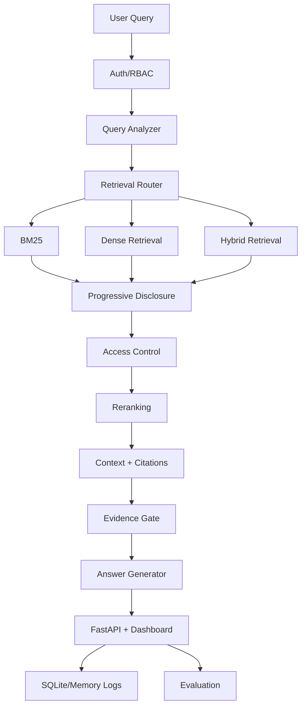

# Architecture

Enterprise Context Engine is a permission-aware context engineering system for enterprise LLM applications. It is built around the idea that the hard part of enterprise RAG is not only finding text. The system must understand the query, choose the right retrieval strategy, enforce access control before generation, build compact grounded context, cite sources, and measure behavior.

## Problem Statement

Enterprise assistants need to answer questions over private company knowledge without leaking restricted information or polluting prompts with irrelevant chunks. A useful system must retrieve evidence that is relevant, accessible to the user, compact enough for generation, and traceable back to source documents.

## Why This Is Context Engineering

Naive RAG commonly embeds chunks, retrieves nearest vectors, and places them directly into a prompt. This project treats retrieval as one part of a larger context pipeline. It decides how to retrieve, stages document and section discovery before final chunk selection, applies permissions before context construction, reranks evidence, builds citation-backed context, and evaluates the whole path.

## Architecture Diagram

```text
User query + user_id
  -> Query analyzer
  -> Retrieval router
  -> BM25 / dense / hybrid / metadata / section lookup
  -> Progressive disclosure
  -> Access-control filter
  -> Reranker
  -> Context builder
  -> Citation builder
  -> Evidence confidence gate
  -> Answer generator
  -> Evaluation + query logs
  -> FastAPI + Streamlit dashboard
```



## Pipeline Stages

- Ingestion
- Chunking
- BM25 retrieval
- Dense retrieval
- Hybrid retrieval
- Query analyzer
- Retrieval router
- Progressive disclosure
- Access control
- Reranking
- Context building
- Citation building
- Evidence confidence gate
- Answer generation
- Evaluation
- API/Dashboard

## Data Sources

- Synthetic enterprise docs for deterministic tests and the default offline demo.
- GitLab Handbook-style public documentation for the real-data ingestion MVP.

The GitLab Handbook MVP currently supports local Markdown files. Live crawling or downloading is intentionally outside this milestone so tests remain deterministic and network-free.

## Data Source Layer

The API and dashboard expose three selectable corpus modes:

- `sample_docs`: synthetic enterprise policies used by deterministic tests and the default product demo.
- `gitlab_handbook`: local public GitLab Handbook-style fixture documents.
- `combined`: synthetic enterprise docs plus GitLab Handbook-style docs.

The selected corpus replaces the in-memory documents and chunks used by `/query` and `/documents`. Query logs are cleared when the active data source changes so logs do not mix corpora. The deterministic evaluation route remains pinned to `sample_docs` until a matching real-source eval set is added.

## Storage Backends

Storage backends:

- `memory`: default test/demo mode with process-local documents, chunks, logs, and eval metrics.
- `sqlite`: optional persistence for document metadata, chunks, query logs, and eval summaries.

SQLite persistence mirrors app state to a local database when `ECE_STORAGE_BACKEND=sqlite`. The API still keeps documents and chunks in memory for retrieval, while SQLite provides restart-friendly metadata, logs, and latest evaluation summaries without requiring PostgreSQL or any external service.

## BM25 Is First-Class

Enterprise questions often include exact policy names, acronyms, limits, document titles, section names, and compliance phrases. BM25 handles exact lexical matching well, so it is not treated as a fallback. Dense retrieval is useful for paraphrases and semantic matches, while hybrid retrieval combines both when the query includes exact and semantic signals.

## Dense Retrieval Backends

Dense retrieval backends:

- `memory`: deterministic default used by tests, offline demos, API, and dashboard.
- `qdrant`: optional production-style vector store for chunk embeddings and metadata payloads.

The Qdrant integration stores chunk embeddings with document metadata payloads and converts semantic search hits back into the same `RetrievalResult` shape used by the in-memory retriever. It is guarded by optional imports and does not require a Qdrant server for normal tests.

## Progressive Disclosure

The system first discovers candidate documents and sections, then fetches focused chunks. This reduces context pollution, makes retrieval easier to inspect, and creates a clearer boundary between broad discovery and final evidence selection.

## Access Control Before Generation

Permissions are enforced before context building and answer generation. Unauthorized users receive a safe abstention message, and restricted document titles, snippets, chunk IDs, and raw source text are not passed into the prompt or returned through the API.

## Evidence Confidence Gate

After secure context building and citation construction, the answer generator runs a deterministic no-evidence gate before calling the LLM. The gate checks query-term overlap, citation presence, document and section title matches, and reranker score signals. If accessible context is too weak or unrelated, it returns the safe abstention message without calling generation.

```text
Secure context building
  -> Evidence confidence gate
  -> Answer generation
```

## Quality Gates

Quality gates:

- deterministic tests
- deterministic evaluation
- no API keys for CI
- optional Qdrant guarded
- SQLite optional
- import and documentation smoke checks
